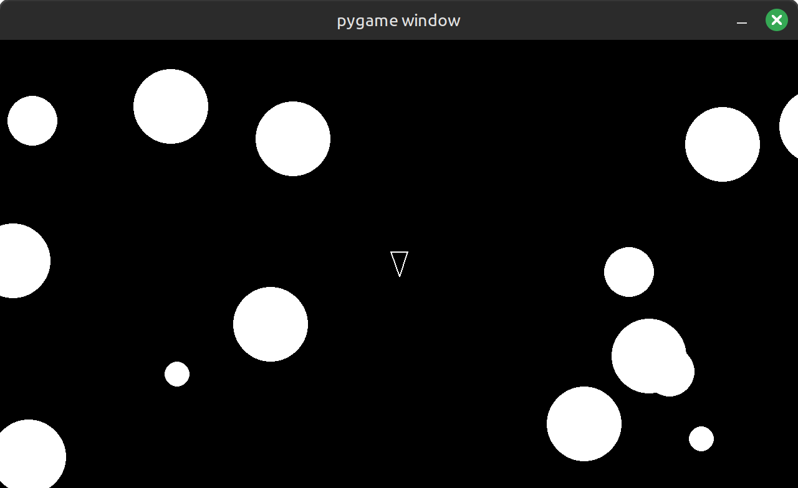

# Asteroids

Asteroids is a [boot.dev](https://www.boot.dev) Python course project using pygame

## Requirements
- Python 3
- pygame 2.6.1 (see requirements.txt)

## Running
`python3 main.py`

## How to play
Use the W A S D keys to move the ship around the screen, avoid asteroids!
Press SPACE to shoot asteriods, breaking them apart into smaller pieces and eventually destroying them.

## Future
- Add highscore
- Add end game/high score screen
- Add new game screen to replay (current requires restarting the app)
- Add powerups